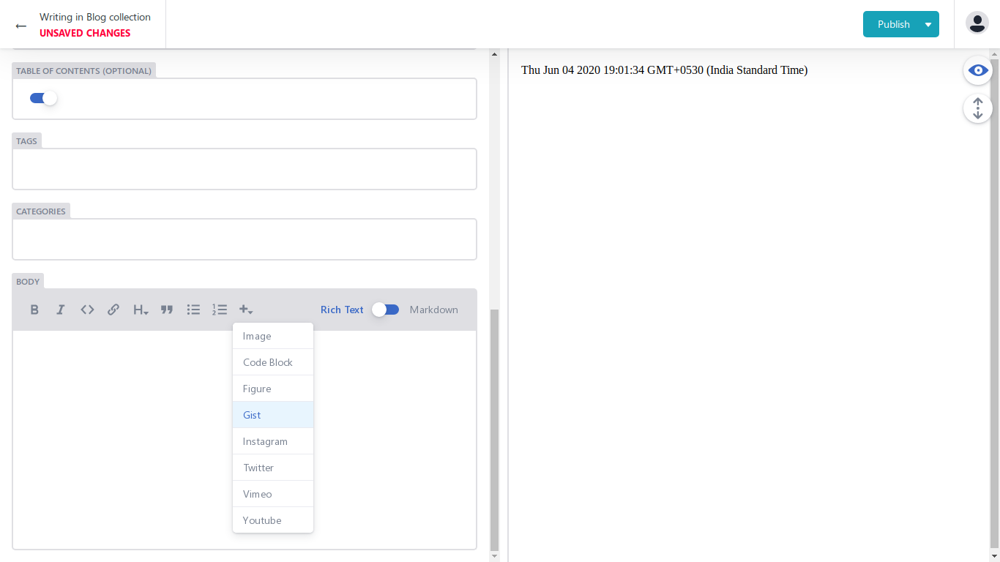

<div align="center">
  <h1>Hugo Shortcodes for Netlify CMS editor</h1>


</div>  

---

A collection of js files for shortcodes of Hugo that enables blocks in Netlify CMS Text Editor.

## List of shortcodes for the text editor
1. [Gist](https://github.com/sharadcodes/hugo-shortcodes-netlify-cms/blob/master/src/gist.js)
2. [Youtube](https://github.com/sharadcodes/hugo-shortcodes-netlify-cms/blob/master/src/youtube.js)
3. [Vimeo](https://github.com/sharadcodes/hugo-shortcodes-netlify-cms/blob/master/src/vimeo.js)
4. [Twitter](https://github.com/sharadcodes/hugo-shortcodes-netlify-cms/blob/master/src/twitter.js)
5. [Instagram](https://github.com/sharadcodes/hugo-shortcodes-netlify-cms/blob/master/src/instagram.js)
6. [Figure](https://github.com/sharadcodes/hugo-shortcodes-netlify-cms/blob/master/src/figure.js)

## USAGE

Add the following after the script tag of **Netlify CMS**

```html
<script src="https://sharadcodes.github.io/hugo-shortcodes-netlify-cms/dist/hugo_shortcodes_netlify_cms.js"></script>
```

## Asking for support!

Hello everyone, If you have used this theme and if it has helped you in any way or if you just want to support me for my open source work, you can support me by donating any amount.

You can use the sponsor button at the top or on the right. 

### [Github Sponsor Page](https://github.com/sponsors/sharadcodes)

---

## SCREENSHOT OF DROPDOWN

## SCREENSHOT OF UI


---

# Resources

## Themes
So I've created some HUGO themes which are listed below, you may want to have a look because they look amazing :)

* [Hugo Theme Serial Programmer](https://github.com/sharadcodes/hugo-theme-serial-programmer)  ([Live Demo](https://sharadcodes.github.io/hugo-theme-serial-programmer/)), this theme is also available for Jekyll & Gatsby.
